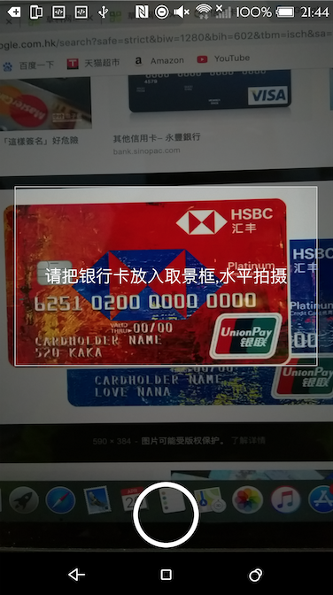

# CardOCR
### 特点
纯 Java 实现，依赖库两个，OpenCV + Tesseract，OpenCV用于一系列图像形态学变换等预处理过程。后者用于文字识别，识别分割后的数字图像。
在检测卡号位置，分割数字上无论对凹凸卡号或是印刷卡号字体效果都很好。
### 准确率
针对银行卡 OCR 卡号目标检测准确率在 80% 以上，包括凹凸卡面。字符识别率90%以上，对于凹凸字符识别准确率很低。
### 不足
一个是上面所说的凹凸卡号字符识别准确率太低，原因是自己训练的 Tesseract traineddata 数据量不足。
### 如何改进
文本区域定位，提高卡号定位准确率，需要对代码中过滤器 RectFilter 的参数做微调.
针对凹凸字体提供足够多的数据样本进行训练，如何训练 Tesseract? 详细可参考 <link>http://xiaosheng.me/2015/12/18/article11/</link>
### app 扫描效果

    

        
        
拍照效果

    

    

        
        
实景拍摄[印刷类]

    

    

            
            
实景拍摄[凹凸类]

    

    

                
                
屏幕拍摄[凹凸类]

        

