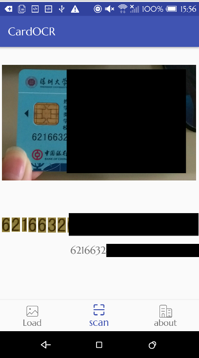

# CardOCR
- 点击下载<a href="https://github.com/toufuChew/CardOCR/releases">APK</a>
### 特点
纯 Java 实现，依赖库两个，OpenCV + Tesseract，OpenCV用于一系列图像形态学变换等预处理过程。后者用于文字识别，识别分割后的数字图像。
识别速度平均 500 ms内，卡号定位与分割效果较可观。
支持识别竖面类型的银行卡，有效的身份证。
### 准确率
针对银行卡 OCR 卡号目标检测准确率在 80% 以上，包括凹凸卡面。字符识别率90%以上，对于凹凸字符识别准确率很低。
### 不足
一个是上面所说的凹凸卡号字符识别准确率太低，原因是自己训练的 Tesseract traineddata 数据量不足。
### 如何改进
针对凹凸字体提供足够多的数据样本进行训练，如何训练 Tesseract? 详细可参考 <link>http://xiaosheng.me/2015/12/18/article11/</link>
### 如何使用
clone 后可能需要针对你的手机摄像头做分辨率的适配，否则可能拍摄时图像会压扁或被拉宽导致识别不准确。
代码位于 `camera/view/CameraSurfaceView`
### app 扫描效果

    

        
        
拍照效果

    

    

        
        
平面类银行卡

    

    

            
            
凹凸类银行卡

    

   

               
               
身份证

       

